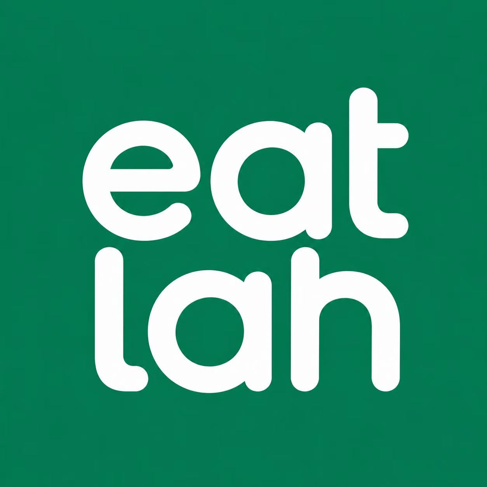

<br />

<p align="center">
  
</p>

<h1 align="center">eatlah</h1>

<p align="center">
  <strong>Snap a menu. Start QR orders.</strong>
</p>

<p align="center">
  AI powered QR ordering for hawker stalls, small restaurants, and independent food businesses.
</p>

<p align="center">
  <a href="#english">English</a> · <a href="#中文">中文</a>
</p>

<p align="center">
  <a href="https://youtu.be/XyLj0yTMp30?si=8n1J6sCwA9E2BQrs">
    
  </a>
</p>

<p align="center">
  <a href="https://eatlah.lovable.app/">Merchant App</a> ·
  <a href="https://eatlah.lovable.app/c/">Customer App</a> ·
  <a href="https://eatlah.lovable.app/demo">Product Demo</a>
</p>

## English

eatlah is a AI powered QR ordering system for hawker stalls, small restaurants, and independent food businesses.

It helps small merchants go digital faster by turning a physical menu photo into a live QR ordering page in minutes. Merchants can review their menu, publish a QR ordering page, receive orders, and manage simple payments from one mobile-first experience.

## Problem

Traditional QR ordering systems can be expensive, slow to set up, and difficult to maintain without technical support. As a result, many small food businesses still rely on manual ordering, which creates queues, repeated price questions, and no easy way for customers to order ahead.

## Solution

eatlah uses AI-assisted menu digitisation to help merchants launch a QR ordering flow quickly. The product is designed to be simple enough for older hawker stall owners, while still giving merchants the core tools they need to run a modern ordering experience.

## Key Features

1. **AI menu digitisation**  
   Merchants can upload or take a photo of their menu, and eatlah helps structure dishes, prices, categories, and options.

2. **Merchant review flow**  
   Before publishing, merchants can review and edit menu items, prices, photos, and availability.

3. **QR ordering page**  
   Once confirmed, the system generates a live QR ordering page that customers can scan to browse and order.

4. **Customer ordering experience**  
   Customers can view the menu, add dishes to cart, place orders, and receive an order number.

5. **Order management dashboard**  
   Merchants can receive, manage, and update customer orders from a simple mobile dashboard.

6. **Flexible payment support**  
   eatlah supports PayNow QR-code payment instructions and cash payment, so merchants can keep payment simple and familiar.

7. **Simple mobile-first design**  
   The interface is designed to be clear, fast, and easy to use for small merchants, including older hawker stall owners.

## Live Links

| Experience | Link |
| --- | --- |
| Merchant app | https://eatlah.lovable.app/ |
| Customer app | https://eatlah.lovable.app/c/ |
| Product demo | https://eatlah.lovable.app/demo |
| Video demo | https://youtu.be/XyLj0yTMp30?si=8n1J6sCwA9E2BQrs |

## Tech Stack

- React
- TypeScript
- TanStack Start / Router / Query
- Vite
- Tailwind CSS
- Supabase
- Gemini VLM / LLM

## Run Locally

```bash
npm install
npm run dev
```

Useful routes:

- `/merchant` - merchant app
- `/c/` - customer hawker centre homepage
- `/c/demo` - customer ordering page

Build check:

```bash
npm run build
```

## Goal

Our goal is to make AI-powered digital ordering affordable and accessible for every small food business, while supporting local merchants and preserving the vibrant hawker culture that makes Singapore special.

## 中文

eatlah 是一个面向小贩摊位、小餐厅和独立餐饮商家的移动端扫码点餐系统。

它帮助小商家更快完成数字化：只需要拍摄一张纸质菜单照片，就可以在几分钟内生成一个可上线的扫码点餐页面。商家可以确认菜单、发布二维码点餐页、接收订单，并用一个简单的手机界面完成日常经营。

## 痛点

传统扫码点餐系统通常费用较高、制作周期长，并且需要专业人员维护。很多小型餐饮商家因此望而却步，仍然使用人工点单方式，导致效率低、顾客常常需要排队，也无法提前下单。

## 解决方案

eatlah 通过 AI 辅助菜单数字化，让商家可以快速把纸质菜单变成线上点餐页。产品界面保持简单、清晰、移动端优先，方便不熟悉复杂系统的小老板和年长摊主使用。

## 核心功能

1. **AI 菜单数字化**  
   商家可以上传或拍摄菜单照片，eatlah 会帮助识别菜品、价格、分类和可选项。

2. **商家确认流程**  
   发布前，商家可以检查并修改菜名、价格、图片和今日供应状态。

3. **二维码点餐页**  
   菜单确认后，系统会生成可上线的二维码点餐页面，顾客扫码即可浏览和下单。

4. **顾客点餐体验**  
   顾客可以查看菜单、加入购物车、提交订单，并获得订单号码。

5. **订单管理工作台**  
   商家可以在手机端接收订单、更新制作状态，并管理顾客订单。

6. **灵活支付方式**  
   eatlah 支持 PayNow 二维码付款说明和现金付款，方便商家沿用熟悉的收款方式。

7. **简单移动端设计**  
   界面强调大字体、大按钮、清晰层级，适合小餐饮商家和年长摊主使用。

## 线上链接

| 页面 | 链接 |
| --- | --- |
| 商家端 | https://eatlah.lovable.app/ |
| 顾客端 | https://eatlah.lovable.app/c/ |
| 产品介绍 | https://eatlah.lovable.app/demo |
| 演示视频 | https://youtu.be/XyLj0yTMp30?si=8n1J6sCwA9E2BQrs |

## 技术栈

- React
- TypeScript
- TanStack Start / Router / Query
- Vite
- Tailwind CSS
- Supabase
- Gemini VLM / LLM

## 本地运行

```bash
npm install
npm run dev
```

常用路由：

- `/merchant` - 商家端
- `/c/` - 顾客端熟食中心首页
- `/c/demo` - 顾客点餐页

构建检查：

```bash
npm run build
```

## 愿景

我们的目标是让 AI 驱动的数字点餐变得低成本、易使用，让每一个小型餐饮商家都能拥有自己的数字化点餐系统，同时支持本地小商家，保留新加坡熟食文化的活力。
